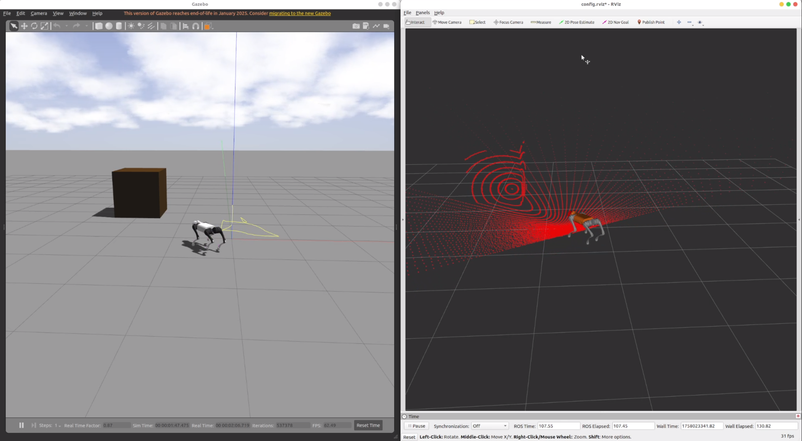

# Legged Localization Benchmark

## 项目简介
用于足式机器人定位方法测试的repo

## 特性
<div align="center">
  
</div>

- 列出主要特性
- 支持的算法/平台
- 可扩展性等

## 安装

```bash
# 克隆仓库
git clone git@github.com:Tipriest/legged_localization_benchmark.git
cd legged_localization_benchmark
git submodule update --init --recursive
```


## 编译

```bash
# for fast_lio

catkin_make
```

## 使用方法

```bash
source devel/setup.bash
roslaunch unitree_guide gazeboSim.launch
# 使用手柄控制
./devel/lib/unitree_guide/junior_ctrl
# 使用键盘控制
# 需要改一下代码，有待完善文档
# 按下手柄的X起立，按下Y切换trot步态，左推杆控制XY移动，右推杆控制Yaw
```

<!-- 详细用法请参考 [文档](docs/) 或代码注释。 -->

## 目录结构

```
legged_localization_benchmark/
├── src/
├── configs/
├── docs/
├── tests/
└── README.md
```

## 贡献指南

欢迎提交 issue 和 pull request！请先阅读 [贡献指南](CONTRIBUTING.md)。

## 许可证

本项目采用 MIT 许可证，详见 [LICENSE](LICENSE)。

## 联系方式

如有问题或建议，请联系：a1503741059@163.com

