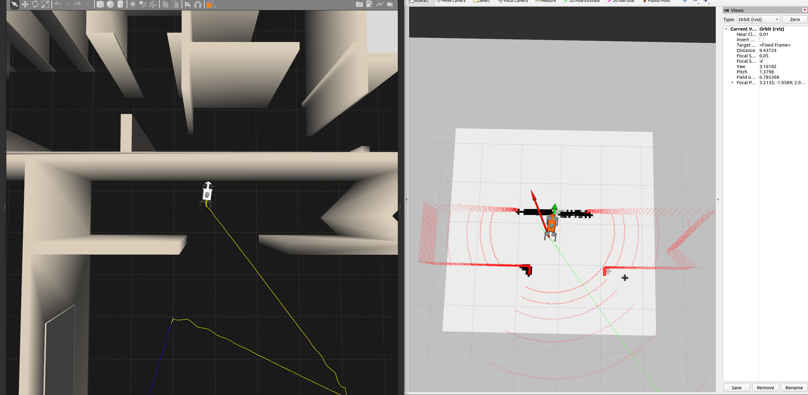

# Legged Localization Benchmark

## 项目简介
用于足式机器人定位方法测试的repo

## 特性
<div align="center" style="margin: 20px 0;">
  
</div>
<div align="center" style="margin: 20px 0;">
  
</div>

- 列出主要特性
- 支持的算法/平台
- 可扩展性等

## 安装

```bash
sudo apt install libgoogle-glog-dev
sudo apt install joint-state-publisher ros-noetic-openni-* ros-noetic-pointcloud-to-laserscan
# 克隆仓库
git clone git@github.com:Tipriest/legged_localization_benchmark.git
cd legged_localization_benchmark
git submodule update --init --recursive
```


## 编译

```bash
# for fast_lio
# install livox_sdk
cd ~/Downloads
git clone git@github.com:Tipriest/Livox-SDK.git
cd Livox-SDK
cd build && cmake ..
make
sudo make install

# go back to legged_localization_benchmark ws
catkin build
```

## 使用方法(使用键盘控制)

```bash
./scripts/sim_keyboard.sh
# 在sim_keyboard.sh打开的第一个terminal终端中，机器人初始为passive状态
# 输入2机器人进入站立fixed stand状态
# 输入3机器人进入free stand状态，此时可以通过wasd控制机器人足端不动，但是机身位置变化
# 输入4机器人进入trotting状态，此时机器人将开始连续踏步，此时可以通过wasd控制机器人移动
# ------------------------------------------------------------------------
# ------------------------------------------------------------------------
# 进入trot状态之后，可以通过键盘上的wasd控制机器人的X和Y方向的速度
# 进入trot状态之后，可以通过键盘上的jl控制机器人的yaw角速度
```

## 使用方法(使用手柄控制)

```bash
./scripts/sim_joystick.sh
# 按住手柄的X键(右侧的左边的方块键)起立，Y键(右侧的上边的三角键)进入TROT模式，然后左旋杆控制移动，右旋杆控制yaw角度
```


## 目录结构

```
legged_localization_benchmark/
├── assets
├── Awesome-Legged-Robot-Localization-and-Mapping
├── build
├── devel
├── logs
├── README.md
├── scripts
└── src
```
## 目前的问题
1. [FIXED]现在示例里面用的是velodyne的16线lidar，对较近的物体lidar是没有输出的，据估计这个
没有输出的范围大概在1m左右，如下图所示，看一下实际的lidar是什么情况，也是一样没有输出吗，如果
不是的话修改现在lidar的仿真模型，是的话就加入一个相机进行补盲
- 大致问了一下，距离很近的话也是会有点的，只是噪声增加的比较严重
<div align="center" style="margin: 20px 0;">
  
</div>
2. 目前的机器人运动远远算不上平稳，尤其是在旋转的时候其实感觉机器人转的不稳定，现在显示想要能够
在旋转的时候小步频快移动
3. move_base在机器人脱困的时候好像对于机器人的包围盒的考虑有点问题

## 一些想做的点
1. 有一个全局地图之后，怎么样使用localization的方法对于随机出生点可以获得自己的位置
2. 对于机器人小跳向前的这种冲击情况进行考虑
3. 光照突然变化
4. 机器人进入电梯
5. 有一个较大的IMU冲击


## 贡献指南

欢迎提交 issue 和 pull request！请先阅读 [贡献指南](CONTRIBUTING.md)。

## 许可证

本项目采用 MIT 许可证，详见 [LICENSE](LICENSE)。

## 联系方式

如有问题或建议，请联系：a1503741059@163.com

